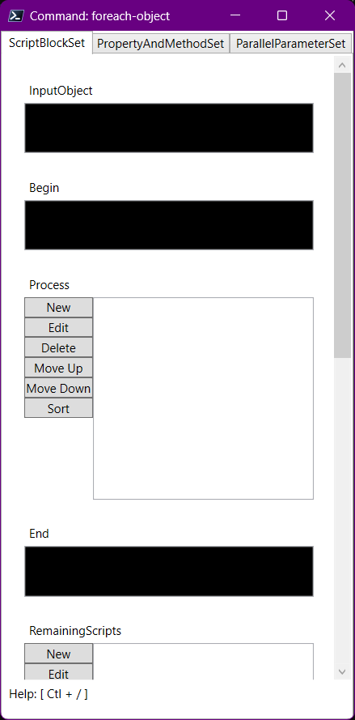
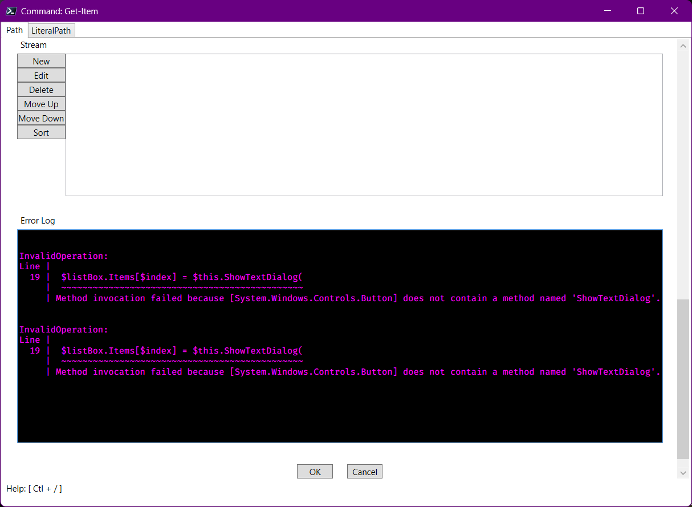
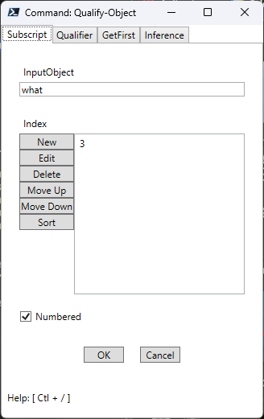
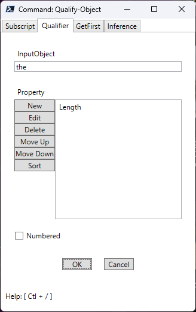
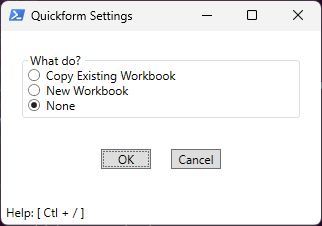

# issue

- [ ] 2025-01-04-024250

  - when

    ```powershell
    Invoke-QformCommand foreach-object
    ```

  - actual

    

  - expected
    - the ``Process`` element has a ``ScriptBlock`` list type

- [ ] 2023-11-19-002106

  - when: Qform open
  - howto
    1. focus Field control
    2. <[kbd](kbd)>Ctl + O</kbd>
  - actual: ``OpenFileDialog`` only selects folders
  - expected: ``OpenFileDialog`` selects files and folders

## complete

- [x] 2025-01-04-025043

  - when
    - leaving a ``DeferredScript`` blank
  - actual
    - evaluates as ``"$()"``
  - expected
    - does not evaluate

- [x] 2025-01-03-065810

  - when

    ```powershell
    Invoke-QformCommand Get-Item
    ```

    Click ``New`` in a list box

  - actual

    

- [x] 2023-12-28-230434

  - actual: Enum As DropDown cannot return Pair

- [x] 2023-11-19-002430

  - when: Qform open with refresh control instead of tab control
  - howto: use ``Get-QformMenu`` but set ``IsTabControl`` to ``False``
  - actual: page line missing

- [x] 2023-11-14-233637

  - when: ``Show-QformMenu`` by ``-Command``
  - what: MenuAnswers only ever marshalls from the first tab in
          TabControl panel
  - howto

    ```powershell
    $result = Show-QformMenu -Command Qualify-Object
    ```

    
    

    ```powershell
    $result.MenuAnswers
    ```

  - actual

    ```text
    InputObject Index Numbered
    ----------- ----- --------
    what        {3}       True
    ```

  - expected

    ```text
    InputObject Property Numbered
    ----------- -------- --------
    the         {Length}    False
    ```

- [x] 2023-11-11-153220

  - ``Show-QformMenu`` fails on some PowerShell profiles
  - howto
    - pwsh

      ```powershell
      ./PsFrivolous/Get-Scripts.ps1 | % { . $_ }

      @"
      {
        "Preferences": {
          "Caption": "What"
        },
        "MenuSpecs": [
          {
            "Name": "MyWhat",
            "Type": "Field"
          }
        ]
      }
      "@ |
      ConvertFrom-Json |
      Show-QformMenu
      ```

  - actual
    - program hangs indefinitely and takes a long time to force-terminate

- [x] 2023-04-17-015015

  - actual
    

    ```powershell
    C:\Users\karlr\Downloads\__POOL> .\MyScript.ps1

    Confirm MenuAnswers
    ------- -----------
       True
    ```

- [x] 2023-04-04-004414

  - when: calling ``Show-QformMenu`` with a set of specs containing a table
  - actual: truncated table
  - expected: all elements resize to fit table
  - cause
    - ``OverflowLayout#ScrollView`` type does not feature auto-resize
      - whereas ``OverflowLayout#Multipanel`` does
  - solution
    - temporary
      - use ``'Multipanel'`` setting in ``Page`` constructor for non-cmdlet-based menus
  - todo
    - [x] permanent solution for all overflow layout types

- [x] 2023-03-20-234805

  - where: ``Controls#Add-ControlsListBox``
    - no multiselect
      - comment: I'm not sure if multiselect would be a good idea.
    - key bindings fail to replicate Windows Explorer behavior
  - solution: cancel
    - good enough

---
[← Go Back](../readme.md)
