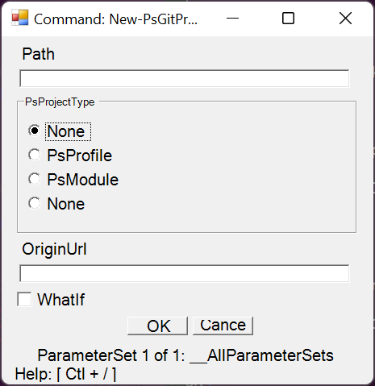
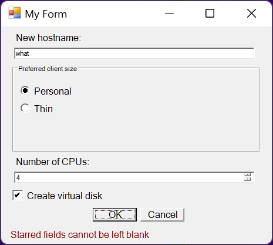

# general
- [ ] review sublayout update workflow

# link
- [ ] https://powershellexplained.com/2017-05-30-Powershell-your-first-PSScript-repository/?utm_source=blog&utm_medium=blog&utm_content=module
- [ ] https://powershellexplained.com/2017-01-21-powershell-module-continious-delivery-pipeline/?utm_source=blog&utm_medium=blog&utm_content=body&utm_content=module

# document
- ---

# controls
- [ ] verify all parameters of each control constructor

## NumberSlider
- [ ] add both ``Int`` and ``Float`` definitions
- [ ] expose ``TextChanged`` event
- [ ] try above without ``Grid`` layer

# key bindings
- [ ] unset
- [ ] restore defaults

# status line
- ---

# issue
- [ ] issue
  - ParameterSet line not centered in main form

- [ ] issue
  - actual
    ```
    Get-ChildItem : Cannot convert 'System.String' to the type
    'System.Management.Automation.SwitchParameter' required by parameter 'UseTransaction'.
    At C:\Users\karlr\OneDrive\Documents\__KASLOVT01\devlib\powershell\Quickform\script\Quickfor
    m.ps1:515 char:24
    +         & $CommandName @params
    +                        ~~~~~~~
        + CategoryInfo          : InvalidArgument: (:) [Get-ChildItem], ParameterBindingExcepti
       on
        + FullyQualifiedErrorId : CannotConvertArgument,Microsoft.PowerShell.Commands.GetChildI
       temCommand
    process
    $result = Invoke-QformCommand -CommandName Get-ChildItem
    ```

- [ ] issue
  - actual
    ```
    Exception calling "Add" with "2" argument(s): "Item has already been added. Key in
    dictionary: 'None'  Key being added: 'None'"
    At C:\Users\karlr\OneDrive\Documents\WindowsPowerShell\Modules\Quickform\script\Con
    trols.ps1:1041 char:9
    +         $buttons.Add($symbol.Name, $button)
    +         ~~~~~~~~~~~~~~~~~~~~~~~~~~~~~~~~~~~
        + CategoryInfo          : NotSpecified: (:) [], MethodInvocationException
        + FullyQualifiedErrorId : ArgumentException
    ```
    - see image
  - process
    - ``$result = Invoke-QformCommand -CommandName New-PsGitProject``



- [ ] issue
  - actual
    ```
    Exception setting "FontFamily": "The property 'FontFamily' cannot be found on this object. Verify
    that the property exists and can be set."
    At C:\Users\karlr\OneDrive\Documents\devlib\powershell\QuickWindow\script\Quickform.ps1:102 char:25
    +                         $myPreferences.$name = $Preferences.$name
    +                         ~~~~~~~~~~~~~~~~~~~~~~~~~~~~~~~~~~~~~~~~~
        + CategoryInfo          : NotSpecified: (:) [], SetValueInvocationException
        + FullyQualifiedErrorId : ExceptionWhenSetting

    Exception setting "Point": "The property 'Point' cannot be found on this object. Verify that the
    property exists and can be set."
    At C:\Users\karlr\OneDrive\Documents\devlib\powershell\QuickWindow\script\Quickform.ps1:102 char:25
    +                         $myPreferences.$name = $Preferences.$name
    +                         ~~~~~~~~~~~~~~~~~~~~~~~~~~~~~~~~~~~~~~~~~
        + CategoryInfo          : NotSpecified: (:) [], SetValueInvocationException
        + FullyQualifiedErrorId : ExceptionWhenSetting
    ```
  - process
    - ``cat .\sample\mylargeform.json | ConvertFrom-Json | Show-QformMenu``

```
__OLD

    [d] issue
        process 
            cat .\sample\myform.json | ConvertFrom-Json | Show-QformMenu
        actual
            See image
        solution
            Radio boxes were being treated like starred text fields when
            their enumerations are marked as mandatory.

            Mandatory enumerations are self-managed. They either do or don't
            implement 'None', and hence don't need to be starred.

            Consume `$mandatory` by marking it False after using it to build
            the object.
```



```
[d] multilayout
[d] parametersets
[d] module
[d] trim result object of unset values
[x] radio box needs check box for 'activate|deactivate'
[d] radio box needs 'None' symbol added unless marked 'Mandatory' in input object
[d] issue 001: `Start-Quickform -CommandName Get-Command` returns null

    solution
        numeric type is not nullable and sends default minimum value '0'
        on evaluation (eg: `-TotalCount 0`, which prevents the above from
        producing output)

        [d] make numeric type nullable (unset by default, return result
            based on both text and value properties)

[d] document of available settings
[d] consider including some functions from 'Other.ps1' in module's exported
    functions

    solution
        Get-TrimObject
        Get-TrimTable

[d] 'get command string'
[d] eliminate 'AsFloat' property of numeric type
[d] status line

    eg: 'Max value reached'

[d] decouple .\script\Controls.ps1 from .\res\*.json;
    allow the option to use hard-coded preferences
[d] function/cmdlet for 'Command' -> 'Quickform spec object'

    solution
        ConvertTo-QformMenuSpecs

[d] mandatory values
[x] option to ignore unset values
[d] ParameterSet line

controls

    [d] date
    [d] path
    [d] calendar
    [x] time
    [d] fieldlist

key bindings

    [d] open file search dialog
        key: Ctrl+O
    [d] open date select dialog
        key: Ctrl+D
    [x] open powershell window
    [d] optional Escape to cancel
    [d] optional Enter to confirm

status line

    [d] idle
    [d] 'Max value reached'

document

    [d] list type
