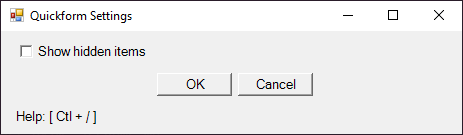

# Description

Create Windows forms on the fly using terse document object specifications.

# Cmdlets

## Show-QformMenu


## Invoke-QformCommand


# Objects

## MenuSpecs

Any call for `MenuSpecs` in the module refers to a `PsCustomObject` that contains a list of specifications for the controls in a Quickform menu.

### Types

#### Check

A boolean value, represented by a CheckBox. When procuring parameters from a PowerShell cmdlet or function, Switch parameters are handled using Checks.

JSON Example:

```json
{
    "Name": "ShowHiddenItems",
    "Type": "Check",
    "Text": "Show hidden items"
}
```



#### Field

A string value, represented by a Label and TextBox. When procuring parameters from a PowerShell cmdlet or function, strings and most other types default to being handled using Fields.

JSON Example:

```json
{
    "Name": "NewHostname",
    "Type": "Field",
    "Text": "Enter a new hostname",
    "Mandatory": true,
    "MaxLength": 20
}
```


#### Enum

One of a set of accepted string values, represented by a RadioBox (a GroupBox containing sequence of mutually exclusive Radio buttons). When procuring parameters from a PowerShell cmdlet or function, enumerated types or string parameters with the `ValidateSet` attribute added are handled using Enums.

JSON Example:

```json
{
    "Name": "MultipleChoice_20",
    "Type": "Enum",
    "Text": "Question 20: Who wrote The Divine Comedy?",
    "Mandatory": true,
    "Symbols": [
        {
            "Name": "A",
            "Text": "A. William Shakespeare"
        },
        {
            "Name": "B",
            "Text": "B. Desiderius Erasmus"
        },
        {
            "Name": "C",
            "Text": "C. Geoffery Chaucer"
        },
        {
            "Name": "D",
            "Text": "D. Dante Alighieri"
        }
    ],
    "Default": "D"
}
```


When `Mandatory` is omitted or set `false`, a 'None' button is added to the box and set by default.

JSON Example:

```json
{
    "Name": "ClientSize",
    "Type": "Enum",
    "Text": "Preferred client size",
    "Symbols": [
        {
            "Name": "Thin"
        },
        {
            "Name": "Personal"
        }
    ]
}
```


#### Numeric

A numeric value, represented by a Label and a value slider (NumericUpDown). When procuring parameters from a PowerShell cmdlet or function, integral, floating-point, and decimal values are handled using Numerics.

JSON Example:

```json
{
    "Name": "TotalCount",
    "Type": "Numeric",
    "Text": "Total number of commands",
    "Minimum": 1,
    "Maximum": 9999
}
```


#### List

A list of string values, represented by a ListBox with functional buttons. When procuring parameters from a PowerShell cmdlet or function, any array type is handled using a List.

JSON Example:

```json
{
    "Name": "PsModulePaths",
    "Type": "List",
    "Text": "PowerShell Module Paths",
    "Default": [
        "C:\\Users\\karlr\\OneDrive\\Documents\\WindowsPowerShell\\Modules",
        "C:\\Program Files\\WindowsPowerShell\\Modules",
        "C:\\WINDOWS\\system32\\WindowsPowerShell\\v1.0\\Modules"
    ]
}
```


### Common Properties

- **Name**: The name of the control to be added. Also the name of the resulting menu answer.
- **Type**: The control type, listed above.
- **Text**: The label text of the control to be added.
- **Default**: A default value, at which to set the menu control.

## MenuAnswers

`MenuAnswers` in the module refers to a `PsCustomObject` that contains a list of key-value pairs returned by a completed Quickform.

An example form in JSON:

```json
{
    "MenuSpecs": [
        {
            "Name": "Hostname",
            "Type": "Field",
            "Text": "New hostname:"
        },
        {
            "Name": "ClientSize",
            "Type": "Enum",
            "Text": "Preferred client size",
            "Symbols": [
                {
                    "Name": "Personal"
                },
                {
                    "Name": "Thin"
                }
            ],
            "Mandatory": true
        },
        {
            "Name": "NumberOfCpus",
            "Type": "Numeric",
            "Text": "Number of CPUs:",
            "Minimum": 1,
            "Maximum": 9,
            "Default": 4
        },
        {
            "Name": "CreateVirtualDisk",
            "Type": "Check",
            "Text": "Create virtual disk",
            "Default": true
        }
    ]
}
```

The resulting form:


PowerShell Output returned by the form:

```powershell
Hostname ClientSize NumberOfCpus CreateVirtualDisk
-------- ---------- ------------ -----------------
myvm01   Personal              4              True
```

## Preferences

`Preferences` in the module refers to a `PsCustomObject` that contains a list of key-value pairs that are used by any of the form-builder cmdlets to construct a form. When no `Preferences` object is provided, a form will be built using defaults provided by the module script itself or from a JSON file.

To query for the path to the default preferences file, call the `$QFORM_DEFAULTS_PATH` variable.

- **Caption**: The form's window caption, or "title".
- **FontFamily**: The form's font typeface.
- **Point**: The form's font point (size).
- **Width**: The form's starting width.
- **Height**: The form's maximum height.
- **Margin**: The form's margin length.
- **EnterToConfirm**: Specifies that pressing Enter anywhere in the form should be equivalent to clicking 'OK' at the end of the form.
- **EscapeToCancel**: Specifies that pressing Escape anywhere in the form should be equivalent to closing the form or clicking 'Cancel' at the end of the form.
- **DateFormat**: The default date-time format to print into a field when a MonthCalendar window is engaged.

# Todo

- [ ] document Table type
- [ ] document Enum DropDown type
- feat
  - [ ] dark theme
  - [x] scrollbar version
    - [x] make adjustments
  - [x] scrollbar version
  - [x] parameter set tabs

---

[Issues](./doc/issue.md)

[Progress](./doc/wish.md)
